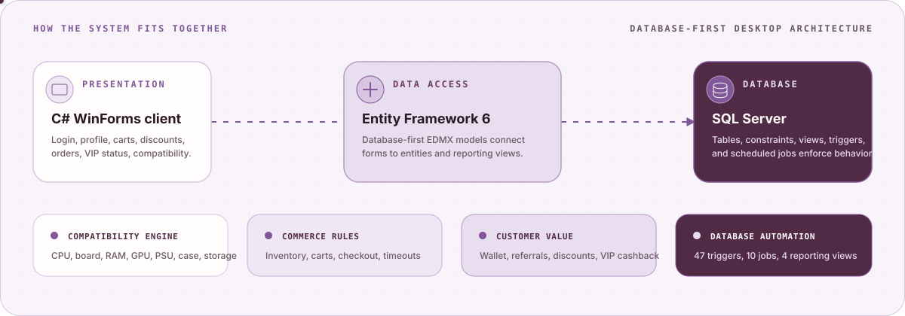

<div align="center">
  
</div>

<div align="center">
  
  
  
  
</div>

## What this project is

PCForge is an end-to-end university database project for a PC parts marketplace. It begins with domain analysis and relational modeling, then carries the rules into SQL Server automation and a connected C# WinForms application.

The system handles more than a product catalog. It models compatibility between PC components, customer wallets, public and private discounts, referral rewards, VIP subscriptions, cart locking, inventory changes, transaction history, and scheduled business rules.

## Work delivered

| Area | Measured scope |
|---|---:|
| Relational tables | 34 |
| SQL Server triggers | 47 |
| SQL Agent job scripts | 10 |
| Reporting and calculation views | 4 |
| SQL Server scripts | 97 files, 3,241 lines |
| MySQL schema drafts | 34 files, 464 lines |
| C# implementation | 67 files, 5,203 lines |
| WinForms UI | 9 forms and user controls |
| Database-first models | 5 EDMX iterations |
| Total tracked SQL and C# | 8,908 lines |

These counts come from the final repository snapshot. Generated WinForms and Entity Framework files are included in the tracked C# total; the application event and query logic accounts for 1,079 lines across ten entry, form, and user-control files.

## Why it goes beyond CRUD

- Component compatibility is stored as explicit relationships and checked across CPU sockets, motherboard slots, RAM limits, GPU connectors, power capacity, storage support, cooling, and case dimensions.
- Database triggers protect stock, validate transactions, apply discounts, update wallet balances, create referral rewards, and enforce customer or cart rules.
- Scheduled jobs handle three-day cart expiration, seven-day blocks, monthly VIP cashback, subscription expiry, and cart access after VIP status changes.
- Views assemble order totals, transaction detail, and VIP cashback calculations for the desktop client.
- The WinForms application exposes registration, login, account details, discount codes, cart state, recent purchases, and VIP information.

## System overview

<div align="center">
  
</div>

## Functional scope

| Domain | Implemented behavior |
|---|---|
| Product catalog | Motherboard, CPU, RAM, cooler, GPU, power supply, case, SSD, and HDD data |
| Compatibility | Socket, slot, connector, power, capacity, frequency, and physical-fit relationships |
| Accounts | Registration, phone-based lookup, profile summary, addresses, referral identity, normal and VIP status |
| Commerce | Multi-item carts, stock reservation, checkout state, cart locking, order totals, and purchase history |
| Payments | Bank and wallet transactions, status validation, wallet deposits, and balance updates |
| Discounts | Public codes, private codes, expiry, usage limits, percentage or fixed-value calculations |
| Loyalty | Referral-chain rewards, VIP subscription timing, five-cart allowance, and 15 percent cashback |
| Operations | Trigger-based validation, scheduled cleanup, state transitions, and reporting views |

## Database automation

The database owns the rules that must remain correct even when the client changes.

| Mechanism | Responsibility |
|---|---|
| Constraints and relationship tables | Preserve entity integrity and PC component compatibility |
| Triggers | Validate writes and update stock, wallets, carts, discounts, and referral state |
| SQL Agent jobs | Run time-based cart, VIP, cashback, and unblock processes |
| Views | Return cart totals, transaction summaries, and VIP benefit calculations |

The editable database model is stored in [`tbl/projtabs (1).drawio`](./tbl/projtabs%20%281%29.drawio).

## Application flow

1. A customer registers or signs in with a phone number.
2. The dashboard loads the account summary, wallet balance, referral data, addresses, and membership state.
3. Separate views expose discount codes, cart details, recent purchases, and VIP timing.
4. Entity Framework queries the SQL Server schema and its reporting views.
5. SQL triggers and jobs enforce inventory, transaction, discount, referral, cart, and subscription rules.

## Requirements and project phases

| Document | What it defines |
|---|---|
| [Phase 0: system brief](./docs/requirements/phase-0-system-brief.pdf) | Domain rules, product types, users, wallet, carts, discounts, transactions, shipping, compatibility, and logging |
| [Phase 3: SQL implementation](./docs/requirements/phase-3-sql-implementation.pdf) | SQL constraints, triggers, jobs, stock behavior, discounts, cart timing, and VIP rules |
| [Phase 4: application](./docs/requirements/phase-4-application.pdf) | Account summary and compatibility features required in the connected application |

## Repository map

```text
.
├── sql sever/                         # Final SQL Server schema and automation scripts
├── my sql/                            # Earlier MySQL schema drafts
├── payga_cs/WindowsFormsApp1/         # C# WinForms solution and Entity Framework models
├── tbl/                               # Editable database model
├── pic/                               # Original UI assets
└── docs/                              # Project brief, implementation notes, and README artwork
```

The original folder names are preserved so the submitted project and its internal references remain intact.

## Run locally

### Prerequisites

- Windows and Visual Studio with .NET desktop development
- .NET Framework 4.7.2 Developer Pack
- SQL Server with SQL Server Agent for scheduled jobs
- Entity Framework 6.2, restored through NuGet

### Setup

1. Create a local SQL Server database named `payga`.
2. Review and run the table and relationship scripts in `sql sever/`, then add views, triggers, and jobs after their dependencies exist.
3. Open `payga_cs/WindowsFormsApp1/WindowsFormsApp1.sln` in Visual Studio.
4. Confirm that the connection strings in `App.config` point to your SQL Server instance and the `payga` catalog.
5. Restore NuGet packages, build the solution, and run `WindowsFormsApp1`.

The scripts are kept as separate files because the repository preserves the staged academic delivery. A consolidated migration runner is not included.

## Project status

The academic feature scope is implemented and preserved in this repository. Running it on another machine still requires a local SQL Server deployment and connection-string setup. The project is a database engineering case study, not a production commerce service.

## Author

Built by [Fatemeh Damavandi](https://github.com/fateme529). For project or product work, contact [fdamavandi529@gmail.com](mailto:fdamavandi529@gmail.com).
